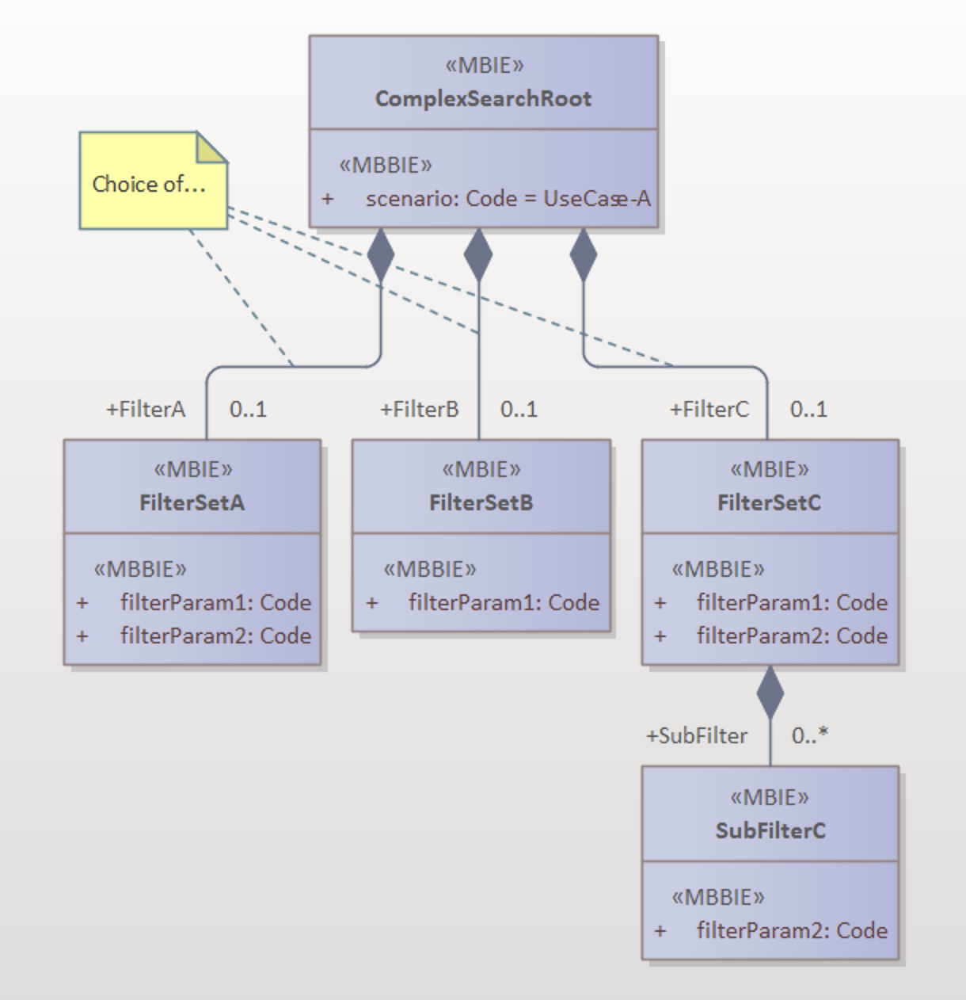

# Use of HTTP operations for RESTful APIs

## Introduction

A core principle of RESTful APIs is the use of standard HTTP operations: GET, PUT, POST, PATCH and DELETE (and to a lesser extent, HEAD and OPTIONS). The CONNECT and TRACE operations are rarely, if ever, used within RESTful APIs and are therefore not considered here.

This appendix provides guidelines for using POST as a complex search operation (POST …//search). An Internet Draft now exists for implementing a new HTTP operation, QUERY. It is expected that, over time, this will replace POST as the method for complex searches. However, since the specification is still under development and there is currently no support for this new operation within existing RESTful API specifications, it will be disregarded for now.

The HTTP standard allows for a considerable amount of flexibility in the functionality and use of operations. Since the sector aims for consistent behaviour across RESTful APIs, it is necessary to further refine how these operations are used. This appendix provides additional guidelines and serves as further clarification of guideline 08.

Each operation is described in terms of application and restrictions, including the use of request and response parameters/payloads. Also outlined are the *specific* response codes logically applicable to each operation.

Additionally, each operation **should** generate several common error codes:

- **400 – Bad Request**: The request contains syntactic errors that make execution impossible.
- **401 – Unauthorized**: The requester must authenticate before calling the operation.
- **403 – Forbidden**: The requester has no rights to perform the given operation or may not execute it on the specified resource.
- **422 – Unprocessable Content**: The request is syntactically correct but contains semantic errors/conflicts preventing execution (only applicable for those operations that receive parameters and/or payloads that require semantic validation).
- **500 – Internal Server Error**: The called application encounters a problem that makes it impossible to execute the requested operation.
- **503 – Service Unavailable**: The called application is currently unavailable.

### Responses to Operations

When designing RESTful APIs, two general approaches can be observed for implementing POST, PUT, and PATCH:

1. Mutation operations (POST, PUT, PATCH) return the (new) state of the modified/created resource.
2. Mutation operations (POST, PUT, PATCH) return only a status.

Both approaches are allowed from a REST ‘best practices’ perspective. However, the downside of option (1) is that it introduces multiple ‘backdoors’ for retrieving a resource. Particularly in large, complex data structures and/or intricate authorisation models, it is not always straightforward to determine exactly what should be returned. Ideally, these algorithms should be implemented in a single location.

Additionally, in the case of POST and PUT, the requester already provides most of the resource state in the request, making the response largely redundant. This results in unnecessary overhead, especially in complex data models. Finally, the response from POST, PUT, and PATCH is not inherently cacheable, unlike GET.

Considering the above, only option (2) is permitted: POST, PUT, and PATCH must return *only a status*, and the GET operation **should** be used to retrieve the resource state. In some cases (where the requester immediately requires the new state), this results in the overhead of one additional GET call. However, the advantages outweigh this drawback.

------

## GET Operation

### Explanation

A GET request with a resource ID is the designated (and only) method for retrieving a specific resource.

The operation **may** result in the following response codes:

- **200 – Success**: The response payload contains only the attributes of the requested resource that the requester has permission to view (see also ID 25). Additionally, the response **may** include an ETag HTTP header with a unique identifier of the resource, which can be used for optimising resource caching and detecting update conflicts. See guideline XXX for details.
- **404 – Not Found**: The provided ID does not correspond to a valid resource.
- **409 – Conflict**: The resource exists, but its current state prevents retrieval, for example, because it is locked.

A GET request without an explicit resource ID serves as a standard search query. A maximum of *five* query parameters may be specified for filtering. If more parameters are needed, if the search functionality is complex, or if privacy concerns arise, POST should be used instead (see further details). Depending on the number and size of responses, pagination may be implemented to divide the results into manageable blocks. See guideline ID 28 for details.

The operation **may** result in the following response codes:

- **200 – Success**: The response payload contains a list (with or without pagination) of all resources matching the search filter. Each resource in this list contains only the attributes the requester is authorised to view (see also ID 25). If no results are found, an empty list **should** be returned.

  It is permitted to limit the search results to only the information necessary for the requester to determine a subset of results, which can then be fully retrieved using GET (with ID).

- **409 – Conflict**: The current state of the collection prevents execution of the search query, for example, because it is locked.

- **422 – Unprocessable Content**: The semantic check in this context may indicate that the request cannot be executed because it would result in an excessively large result set (e.g., querying a large collection without an explicit filter or with unrealistic filter parameters).

In all cases, a GET request must never contain a request body!

### Justification

Retrieving the current state of a resource must always yield consistent results. Therefore, returning the resource state via alternative methods such as POST, PUT, or PATCH, where state consistency cannot be guaranteed, is not allowed. Additionally, the general REST principle states that a resource must have **exactly one unique identity** (URI). This principle is easily enforced by linking the resource to a GET URL combined with a resource ID in this URL.

An additional advantage is that access control for the attributes of the resource only needs to be enforced in one place (the GET request), reducing the risk of data leaks.

### Exception

A GET URL must never contain personally identifiable information (PII), meaning information that can directly or indirectly be traced back to individuals.

For a GET request on a resource, this requires careful selection of the resource ID format (e.g., never use a social security number to identify a person). Ideally, a resource ID should be a UUID.

When using GET as a search query, special attention should be given to the combination of query parameters. If this combination could lead to the exposure of sensitive information, POST should be used instead of GET to implement the search function.

------

## PUT Operation

### Explanation

A PUT request is always executed on a unique resource (i.e., a URL that determines the unique identity of the resource). The result is that the server replaces the existing resource (if present) with a new version, where the state is determined by the received attributes while maintaining the resource’s identity. This means that some attributes may be removed (if they are no longer included in the new state), while new attributes may be added (if they were not present in the previous state).

Additionally, the requester **may** include an **If-Match** header containing the ETag key known to them for the respective resource. This allows the server to validate the resource state before executing the update (see guideline XXX for details).

The operation **may** result in the following response codes:

- **202 – Accepted**: The request has been received and successfully validated but has not yet been executed. This can happen in case of asynchronous processing. If the requester wants to ensure that the changes have been applied, they must perform a GET request at a later time to check the state.
- **204 – No Content**: The replacement was successful, and no response is returned, as the updated resource state can be retrieved via a GET request (see justification under GET). The response **may** optionally include an **ETag** header containing the (new) ETag key of the modified resource.
- **404 – Not Found**: The provided ID does not correspond to a valid resource.
- **409 – Conflict**: The resource exists, but its current state prevents updates, for example, because it is locked or because the provided **ETag** key does not match (conflicting update).

A PUT request must never contain a response body (except for responses related to error messages)!

### Justification

The PUT operation should be used primarily for updating the existing state of a resource. Within the principle of separation of concerns, this is also its only intended purpose. Creating a new resource instance or retrieving the updated resource state does not fall under the responsibility of the PUT operation. For this reason, PUT does not return a response body, except for success or error messages.

Another reason why PUT does not return a resource as a response is related to caching. A PUT operation is **not** idempotent, and its results are not necessarily cacheable, unlike GET.

### Exception

None.

------

## POST Operation

### Explanation

#### Create a new resource

The primary function of the POST operation on a collection is to create a new resource within that collection. The requester typically provides the desired state of the resource in the request body without specifying a primary key.

A POST operation in this form should never contain a response body (except for responses related to error messages)!

The operation **may** result in the following response codes:

- **201 – Created**: The new resource has been successfully created. The operation **should** return an absolute URL in the **Location** header, allowing retrieval of the newly created resource via GET. If the operation cannot return a complete URL, it is also permitted to return only the resource ID of the newly created resource via the **X-Object-ID** header.
- **202 – Accepted**: The request has been received and successfully validated but has not yet been executed. This occurs, for example, in asynchronous processing. The implementation is responsible for informing the requester about the progress and how the identity of the created resource is communicated (e.g., via a callback interface).
- **409 – Conflict**: A new resource cannot be created because the provided state conflicts with existing resources and/or the current state of the collection (e.g., if the collection is locked).

#### Implement complex search

A POST operation can also be used to implement a complex search function. In this case, it is strongly recommended to create a separate **search** endpoint within the respective collection (effectively acting as a controller). This ensures a clear distinction between resource creation (POST on ) and resource searching (POST on **/search**). The POST request contains one or more filters, and the response includes the found results (repeating the POST call in case of pagination).

The chosen solution follows a functional semantic approach. In other words, the operation behaves as a **remote procedure call**. This does not fully align with traditional REST principles but has the significant advantage of being easy to implement and understand.

The request payload for a complex search function may consist of a **choice** between different filter objects, where each filter object implements a different use case for the search function. In this case, the root object (containing the filters) may include one or more **discriminator** attributes that determine which filter is relevant for a specific search query. Alternatively, the server can infer the use case from the provided choice item, as a choice only allows a single option. This approach prevents the proliferation of search endpoints within the same collection while allowing easy expansion of search functionalities with new use cases.

**Example:**



The example illustrates a complex search with three different filter sets. The **scenario** discriminator attribute explicitly indicates which filter set is relevant.

The operation **may** result in the following response codes:

- **200 – Success**: The response payload contains a list (possibly paginated) of all resources found based on the search filter. Each resource in this list contains only the attributes that the requester is authorised to view (see also ID 25). If no results are found, an empty list should be returned.

  It is permitted to limit search results to only the necessary information for the requester to determine a subset of results, which can then be fully retrieved using GET (with ID).

- **409 – Conflict**: The current state of the collection prevents the execution of the search query, for example, because it is locked.

- **422 – Unprocessable Content**: The semantic check in this context may indicate that the request cannot be executed because it would result in an excessively large result set (e.g., querying a large collection without an explicit filter or using unrealistic filter parameters).

##### Alternative solution

A more 'REST-compliant' alternative of a complex search is also possible. This would require three separate operations:

1. Create a "search resource" using POST and filters (effectively creating a "view" on the data).
2. Perform one or more GET operations on the resource (view) to retrieve the data.
3. Delete the "search resource" using DELETE.

This implementation, using persistent filters, can be advantageous when the filters are complex, expensive to create and/or are reusable over a longer period of time.

### Justification

#### POST as a Create Operation

Use the POST operation primarily for creating a new resource. As part of the principle of separation of concerns, this is its only responsibility. Retrieving the updated resource state does **not** fall under the responsibility of the POST operation. For this reason, POST does not return a response body, except for success or error messages. However, it does return a link to the newly created resource, which can then be retrieved using GET.

Another reason why POST does not return a resource in its response is related to caching. A POST operation is **not** idempotent, and its results are not cacheable, unlike GET.

#### POST as a Complex Search Function

Using POST to implement complex search functions is a widely accepted **best practice** as long as no alternative exists (the QUERY operation is under development, but general support for it is still lacking).

From a maintainability and readability perspective, it is important to distinguish between both variants. Therefore, it is recommended to place the **search** variant under a separate **/search** endpoint to avoid future conflicts with the **create** variant.

### Exception

#### POST as a Create Operation

In some cases, both parties may have a resource key. In such situations, the party that manages the resource always determines the primary key. Any alternative key should be assigned to a designated functional attribute within the resource.

**Possible Scenarios:**

1. The requester sends their key as the master resource ID to the server. When creating the resource on the server, this key is replaced by a new server-generated key, and the requester’s key is moved to another predefined attribute.
2. The requester sends their key as an alternative resource ID to the server. When creating the resource, nothing changes; only a new server-generated master resource ID is added.
3. The requester sends their key as the master resource ID to the server. If the key is valid as a master resource ID, the server adopts it. Both parties now have the same key. If the key is invalid, the server returns a **409 – Conflict** error.
4. The requester sends their key as the master resource ID to the server. The server ignores this key and replaces it with its own key when creating the resource. The requester detects this change (e.g., by inspecting the **Location**header) and updates their version with the new key.

In all cases, the requester must never assume that a provided key will actually be used as the unique resource identifier, unless this is explicitly specified in the service design documentation!

------

## DELETE Operation

### Explanation

A DELETE operation on a single resource is intended to remove that resource. More specifically, this means that subsequent operations on the resource should return a **404 (“Not Found”)** error code. Additionally, the requester **may** include an **If-Match** header containing the ETag key known to them for the respective resource. This allows the server to validate the resource state before executing the delete operation (see guideline XXX for details).

In theory, a DELETE operation can also be applied to an entire collection, resulting in the removal of all resources within that collection.

A DELETE operation should never contain a response body (except for responses related to error messages), with **rare exceptions** (see "Exception" below).

The operation **may** result in the following response codes:

- **200 – OK**: The resource(s) have been successfully deleted, and a status overview is available in the response payload. This is an exception (see "Exception" below).
- **202 – Accepted**: The request has been received and successfully validated but has not yet been executed. This can occur in cases of asynchronous processing. If the requester wants to ensure that the resource has indeed been deleted, they must perform a GET request at a later time.
- **204 – No Content**: The resource(s) have been successfully deleted.
- **409 – Conflict**: The operation cannot be executed because the current state does not allow it (e.g., due to an ETag mismatch or because the collection or resource is locked).

### Justification

The DELETE operation is solely intended for removing one or more resources. Within the principle of separation of concerns, this is its only responsibility. Returning the last known state or any other data is **not** part of the DELETE operation's responsibility. For this reason, DELETE does not return a response body, except for success or error messages.

### Exception

In **special cases**, a DELETE operation **may** return a **200 – OK** response along with a response payload containing details about the deletion process. The HTTP specification allows DELETE to include a **status response**.

However, this **does not** mean that the full resource state (which no longer exists) is included in the response. Instead, it is primarily used for returning archive links or similar references in cases where the resource was not physically deleted but was instead archived.

For DELETE operations on a collection, it may be useful to include information in the response indicating the number of resources successfully deleted, along with any relevant statistical details.

------

## PATCH Operation

### Explanation

A PATCH operation is always performed on a unique resource (i.e., a URL that determines the unique identity of the resource). With a PATCH operation, it is possible to selectively update parts of a resource. Within the HTTP standard, PATCH is a special case because it is not part of the core HTTP specification but is instead described in several separate RFCs (thus, it should be considered an extension to HTTP). There are also multiple forms of PATCH, each with its own challenges. [This web page](https://williamdurand.fr/2014/02/14/please-dont-patch-like-that/) provides a useful overview and also refers to an alternative implementation ([JSON Merge Patch](https://datatracker.ietf.org/doc/html/rfc7396)).

The original implementation of PATCH ([JSON Patch](https://datatracker.ietf.org/doc/html/rfc6902)) uses a set of “update rules” that allow the requester to specify exactly what should be done (delete, add, replace, copy). This is a relatively complex mechanism but has the advantage of explicitly defining the intended changes. Example:
```json
[
{ "path": "/a/b/c", "op": "test", "value": "foo" },
{ "path": "/a/b/c", "op": "remove" },
{ "path": "/a/b/c", "op": "add", "value": ["foo", "bar"] },
{ "path": "/a/b/c", "op": "replace", "value": 42 },
{ "path": "/a/b/c", "op": "move", "to": "/a/b/d" },
{ "path": "/a/b/d", "op": "copy", "to": "/a/b/e" }
]
```
This model is fully described in [RFC 6902](https://datatracker.ietf.org/doc/html/rfc6902) and is allowed as an implementation, provided it is explicitly mentioned in the service design documentation, as it requires considerable implementation effort from both the client and the server. The advantage, however, is that it makes the intended changes very explicit.

The content type for this PATCH variant **should** be `application/json-patch+json`.

As a simpler alternative, [JSON Merge Patch](https://datatracker.ietf.org/doc/html/rfc7396) can be used. The content type for this PATCH variant **should** be `application/merge-patch+json`. The advantage of this second variant is that it is easier to implement, as only the modified content needs to be transmitted. The disadvantages include the lack of explicit expressiveness and poor support for arrays (to modify an array, a complete new version of the array must be provided). Because the request payload in this case must support many variations (all permutations possible within the data model), an explicit schema is generally not used for the request, but rather a JSON “any” schema. The server dynamically validates the received data and applies the identified structures to the existing resource state where possible.

Additionally, along with the resource identification, the client **may** also provide an **If-Match** header containing the ETag key known to the client for the given resource. This allows the server to validate the state of the resource before executing the update operation (see guideline XXX for details).

The operation **may** result in the following response codes:

- **202 – Accepted**: The request has been received and successfully validated but has not yet been executed. This can happen in cases of asynchronous processing. If the requester wants to ensure that the changes have been applied, a later GET request must be performed to check the state.
- **204 – No Content**: The update was successful, and no response is returned since it can be retrieved via a GET operation (see justification under GET).
- **404 – Not Found**: The specified ID does not correspond to a valid resource.
- **409 – Conflict**: The resource exists, but its current state makes it impossible to update, e.g., because it is locked or the ETag key differs (conflicting update).

A PATCH operation **should not** contain a response body (except for error messages that are part of failure responses)!

### Justification

The PATCH operation is intended for selectively updating a resource. In the context of responsibility separation, this is also its sole function. Returning the latest known state, for example, does **not** fall under the responsibility of this operation. For this reason, PATCH does not return a response body, other than success or error messages.

### Deviations

None.

------

## HEAD Operation

### Explanation

A HEAD operation is always performed on a unique resource (i.e., a URL that determines the unique identity of the resource). HEAD allows retrieving **only** the HTTP headers that the server would have sent if the corresponding GET request had been executed, but **without** the complete payload. The HEAD operation is only useful if the server returns meaningful header information. The most relevant headers include:

- **Content-Type**: The content type(s) that the endpoint will return (e.g., application/json).
- **Content-Length**: The length (in bytes) of the corresponding GET response payload.
- **ETag**: The ETag key of the corresponding GET response payload.

The operation **may** result in the following response codes:

- **204 – No Content**: The standard success response for HEAD, as no response body is returned by definition.
- **404 – Not Found**: The specified ID does not correspond to a valid resource.
- **501 – Not Implemented**: The server does not support the HEAD operation.

A HEAD operation **should never** contain a response body (except for error messages in failure responses)!

### Justification

The HEAD operation can be useful for retrieving metadata (such as ETag and other headers) without receiving the full payload. Possible use cases include checking whether a resource exists or determining if a resource has been modified (in which case the server should return the ETag header).

### Deviations

None.

------

## OPTIONS Operation

### Explanation

The purpose of the OPTIONS operation is to request metadata for a given endpoint (a resource). The response consists of a set of HTTP header parameters that indicate, among other things, which operations are allowed for that endpoint, whether and for how long responses may be cached, which security requirements apply, which content types are accepted, etc. Here is an example of an OPTIONS response:

```HTTP
HTTP/1.1 204 No Content
Allow: OPTIONS, GET, HEAD, POST
Cache-Control: max-age=604800
Date: Thu, 13 Oct 2016 11:45:00 GMT
Server: EOS (lax004/2813
```

The server **may** send the following header parameters in an OPTIONS response:

- **Content-Type**: The content type(s) that the endpoint can return (e.g., application/json).
- **Allow**: The operations supported by the endpoint (e.g., PUT, POST, GET).
- **Cache-Control**: Instructions for response caching.
- **Vary**: Determines which request components influence the response; this is generally used to ensure correct response caching.
- **Connection**: Indicates whether the network connection remains open after a request/response transaction (keep-alive) or if it must be re-established for each transaction (close).
- **Keep-Alive**: Specifies parameters for maintaining a network connection when Connection: keep-alive is used.

The server **may** also send other header parameters if they are considered relevant in the given context.

The operation **may** result in the following response codes:

- **204 – No Content**: The standard success response for OPTIONS, as a response body is typically not returned.
- **404 – Not Found**: If the URL contains a resource ID and the specified ID does not correspond to a valid resource.
- **501 – Not Implemented**: The server does not support the OPTIONS operation.

An OPTIONS operation **should never** contain a response body (except for error messages in failure responses)!

### Justification

Supporting the OPTIONS operation can be useful for clients to gain insight into the operations and/or content supported on specific endpoints. However, the OPTIONS operation **should never** return information that could lead to a violation of security and/or privacy regulations.

### Deviations

None.
