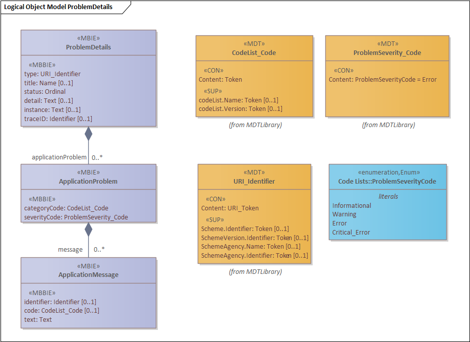

# Error handling for RESTful APIs

## Introduction

When designing RESTful APIs, it is essential to pay sufficient attention to application error reporting. Simply returning a “400” (the HTTP equivalent of “an error has occurred”) is clearly not sufficient. Furthermore, it is important that error reporting is handled consistently across all RESTful APIs so that API consumers are not confronted with different mechanisms, structures, and naming conventions for different APIs.

The objective of this chapter is to introduce a standardized approach to error reporting.

## Implicit error codes

HTTP error codes typically have two sources:

1. The *application* that implements the invoked RESTful API (*explicit* error codes);
2. The *network components* that exist between the client and the application (*implicit* error codes);

The scope of standardized error reporting is **only** the application that implements the RESTful API (*explicit* codes). Client applications **must** be aware that the second category exists and that they can thus receive HTTP errors from network components that are not documented in the *Open API Specification* (OAS) schemas (implicit error codes **could** be documented but this is not mandatory). Examples of common implicit codes are 405 (Method not allowed), 428 (Precondition required), 429 (Too many requests), 501 (Not implemented) or 503 (Service unavailable). The format of the response for an implicit error code is **undefined** since it depends on the network component that issued the error. Clients **should** be designed such that they can properly process **any** explicit or implicit HTTP error code.

### 405 - Method not allowed

A 405 (Method not allowed) error code indicates that the server knows the request method, but the target resource does not currently support this method. The server **must** generate an [`Allow`](https://developer.mozilla.org/en-US/docs/Web/HTTP/Reference/Headers/Allow) header in a 405 response with a list of methods that the target resource currently supports.

### 428 - Precondition required

A 428 (Precondition required) error code indicates that the server requires the request to be conditional. Typically, a 428 response means that a required precondition header such as [`If-Match`](https://developer.mozilla.org/en-US/docs/Web/HTTP/Reference/Headers/If-Match) is missing. When a precondition header does not match the server-side state, the response **should** be a 412 (Pecondition failed) error code instead.

### 429 - Too many requests

A 429 (Too many requests) error code is typically issued when the client sends more requests per unit of time that the server is willing or able to process. The error code **should** be accompanied by a HTTP [`Retry-After`](https://developer.mozilla.org/en-US/docs/Web/HTTP/Reference/Headers/Retry-After) header which specifies the time (in seconds) that the client should wait until attempting new requests. Depending on the API gateway, other HTTP headers **may** be supplied as well, providing additional information.

### 501 - Not implemented

A 501 (Not implemented) error code means that the server does not support the functionality required to fulfill the request.

A 501 code is the appropriate response when the server does not recognize the request method and is incapable of supporting it for any resource. Servers are required to support [`GET`](https://developer.mozilla.org/en-US/docs/Web/HTTP/Reference/Methods/GET) and [`HEAD`](https://developer.mozilla.org/en-US/docs/Web/HTTP/Reference/Methods/HEAD), and therefore **must not** return `501` in response to requests with these methods. If the server does recognize the method, but intentionally does not allow it, the appropriate response is a 405 (Method not allowed) error code.

### 503 - Service unavailable

A 503 (Service unvailable) error code indicates that the server is currently not ready to handle the request. Common causes are that a server is down for maintenance or overloaded. During maintenance, servers **may** return a 503 error for the duration of the maintenance session. In overload cases, some server-side applications will reject requests with a 503 error when resource thresholds like memory, CPU, or connection pool limits are met. Dropping incoming requests creates backpressure that prevents the server's compute resources from being exhausted, avoiding more severe failures. 

If requests from specific clients are being restricted due to rate limiting, the server **should** return a 429 (Too many requests) error code instead of a 503.

The 503 error response **should** be used for *temporary conditions* and the [`Retry-After`](https://developer.mozilla.org/en-US/docs/Web/HTTP/Reference/Headers/Retry-After) HTTP header **should** contain the estimated time for the recovery of the service, if possible.

------

## An error reporting standard: RFC-9457

The [Dutch government API strategy](https://docs.geostandaarden.nl/api/API-Strategie-ext/#error-handling-0) designates the [RFC-7807](https://datatracker.ietf.org/doc/html/rfc7807) standard as the basis for error reporting. However, this RFC has since been replaced by [RFC-9457](https://datatracker.ietf.org/doc/html/rfc9457), and the recommendation to the sector is to follow this latest version. The differences between the two are minimal.

The content type to be used for error responses according to RFC-9457 **must** be:

`application/problem+json`

The RFC-9457 standard defines a ‘*Problem Details Record*,’ which **should** include **at least** the following attributes:

| Atttribute: | Definition:                                                  |
| ----------- | ------------------------------------------------------------ |
| *type*      | A JSON string in the form of a URI reference that uniquely identifies the type of error. Different error types must have distinct URIs. If the URI is structured as a URL (i.e., starting with ‘http’ or ‘https’), it should ideally be dereferenceable, leading to a page with detailed information about the error type.<br />The type attribute may have the value "about:blank" if the HTTP status code itself is deemed sufficiently clear to serve as a response. However, this will rarely be the case.<br /><br />Since the URI standard dictates that standardized URI's should be used for standardized terms and definitions, the URI '`https://datatracker.ietf.org/doc/html/rfc9110#name-{code}-{code-summary}`' **should** be used. |
| *title*     | A short JSON string providing a human-readable description of the error **type**, such as "*Unable to authenticate client*" or "*Parameter validation errors*".<br/>The type and title fields are intrinsically linked, where **type** identifies the *error category*, and **title** provides a *comprehensible name* for it.<br/>If type has the value `about:blank`, the title field is expected to contain the normative name of the associated HTTP status code (e.g., "*Forbidden*" for HTTP 403). |
| *status*    | A JSON number corresponding to the original HTTP status code generated by the server for the error. This code may differ from the actual HTTP response code due to modifications by routers, gateways, firewalls, or other intermediaries between the client and the server. |

In addition to the required fields, the RFC-9457 standard defines several optional elements:  

| Attribute  | Definition                                                   |
| ---------- | ------------------------------------------------------------ |
| *detail*   | A JSON string containing a more detailed error message, providing the recipient with a clearer understanding of what went wrong. Note that including debug information such as stack traces is **not allowed**! |
| *instance* | A unique identifier for this specific *Problem Details Record*. Each generated error must have a unique instance ID. The RFC-9457 standard states that this can be a locator leading to a page with information about the error instance. However, it may also be a URI that is relevant to the server but opaque to the client. The government standard prescribes using a UUID, and our proposal is to follow this approach. Example:<br />`"instance": "urn:uuid:ebd2e7f0-1b27-11e8-accf-0ed5f89f718b"`<br />The instance attribute can be used, for example, to locate the error record in a larger error log. |

Example:

```JSON
"type": "https://datatracker.ietf.org/doc/html/rfc9110#name-{code}-{code-summary}",
"title": "Description of the error",
"status": {code},
"detail": "More details regarding the error can be found here",
"instance": "urn:uuid:ebd2e7f0-1b27-11e8-accf-0ed5f89f718b"
```

------

## General rules

When implementing a *Problem Details* record, it is important to remember that not everything necessarily requires a new type. For some error messages, the HTTP status code is already sufficiently descriptive, and the `detail` attribute can be used to provide a more specific error message. For example:  

```json
{
 "type": "https://datatracker.ietf.org/doc/html/rfc9110#name-401-unauthorized",
 "title": "Unauthorized",
 "status": 401,
 "detail": "Invalid or missing credentials."
}
```

In this case, the HTTP status code already conveys the core issue, while detail provides additional context. No additional attributes are required.

When defining new problem types, the following rules must be observed:

1. **Avoid exposing sensitive information** in error messages, whether in human-readable text or additional attributes in the response payload, that could be exploited by third parties.
2. **Do not include implementation-specific or technical details** such as stack traces in the response.
3. **Avoid defining problem types that are already clearly described by the HTTP status code**. Example: A 403 Forbidden response for a PUT operation on a resource already clearly indicates that the resource cannot be overwritten. There is no need for an additional message stating the same. As a best practice, the type catalog should include standard entries for commonly used HTTP error codes to ensure consistent reporting.
4. **It is allowed to extend the standard with additional fields.** The API standard makes use of this flexibility to add extra records, allowing for arbitrarily complex error messages to be constructed in a standardized way.

------

## Application specific error types

Most of the HTTP errors can be identified using their standard URI (`https://datatracker.ietf.org/doc/html/rfc9110#name-{code}-{code-summary}`). In case of application errors, a specialized type is required with an URI that adheres to the URI standard for linked data. The accompanying HTTP error code will mostly be either 400 (in case of syntax errors) or 422 (in case of semantic errors).

### Error Type Catalogue  

Ideally, we should maintain a catalogue of error types. This catalogue should contain the following information:  

#### 1. Error type identifier  
An URI that provides access to a specific entry in the catalogue. The format is:  
`Https://referentiegegevens.energiesysteem.nl/error-codes/id/<error-code>`

These URI's **should** be dereferencable so that, when copied into a browser, a page is returned containing detailed information regarding the error.

<u>Example</u>:

```json
"https://referentiegegevens.energiesysteem.nl/error-codes/id/912"
```

#### 2. Title

A textual description of the error type, readable by end users, which can be used as the **title** attribute in error responses.

#### 3. HTTP status code

The HTTP error status code (or codes) that this error type applies to. Ideally, there should be a one-to-one mapping, but some types may be relevant for multiple status codes.

#### 4. Detail text

A string containins a description for the details text field.

------

## Generic ProblemDetails Type

Based on the above information, it is possible to define a **generic model** that can serve as the **standard error response object** for RESTful APIs:


*Standard model for problem details*

The root of this model is a `ProblemDetails` class, which is essentially a one-to-one implementation of the model from the **RFC-9457** standard. An additional field, **traceID**, has been added to facilitate faster and more efficient error tracing and to correlate related messages.  

The **traceID** format is designed to be compatible with *[OpenTelemetry](https://www.dynatrace.com/monitoring/integrations/opentelemetry/?utm_source=google&utm_medium=cpc&utm_term=opentelemetry&utm_campaign=benelux-observability-observability-tct&utm_content=none&utm_campaign_id=9355136292&gclsrc=aw.ds&gad_source=1&gclid=EAIaIQobChMI3d7e6LyJjAMV6UNBAh0WOQVOEAAYASAAEgIkQPD_BwE)*. It consists of the following components:   `\<version>-\<trace_id>-\<span_id>-\<trace_flags>`

Example:

```text
00-80e1afed08e019fc1110464cfa66635c-7a085853722dc6d2-01
```

<u>TraceID structure</u>:

| **Component** | **Definition**                                               |
| ------------- | ------------------------------------------------------------ |
| *version*     | Version of this trace format.                                |
| *trace_id*    | All messages that are part of the same **trace** (i.e., a transaction) share the same trace_id, logically linking them together. |
| *span_id*     | Within a trace, messages can be further linked using the **span_id**. Messages can also reference span_id as a parent identifier (e.g., `"parent_id": "0x051581bf3cb55c13"`), forming a hierarchical structure. |
| *trace_flags* | Indicators that are passed along with the trace.             |

In principle, objects of the **ProblemDetails** type can be used directly as error responses, as they contain the relevant information needed for many generic errors. If additional details are required, an **extension** in the form of an array of **ApplicationProblem** objects can be used to provide feedback on application-specific errors.  

### Extension class: ApplicationProblem  

An *ApplicationProblem* class can be used to report a specific category of errors. Each ApplicationProblem class can, in turn, include an optional list of *ApplicationMessage* classes, which are intended to provide additional details about the problem.  

Attributes are defined as follows:

| Attribute      | Definition                                                   |
  | -------------- | ------------------------------------------------------------ |
  | *categoryCode* | An enumeration defining an application-specific error category. Examples include:<br />- *Validation Errors<br />- Processing Errors<br />- Communication Errors* |
  | *severityCode* | Indicates the *severity* of the error, ranging from Informational, to Warning, to Error, and finally to Critical Error. |

### Extension class: ApplicationMessage  

Each category typically defines its own **detail records**, represented by objects of type **ApplicationMessage**, which include the following attributes:  

| Attribute    | Definition                                                   |
| ------------ | ------------------------------------------------------------ |
| *identifier* | A unique identifier (application-specific) for the error type. |
| *code*       | An enumeration linking an application-specific error code to the identifier. Each ID has a corresponding **unique** error code. |
| *text*       | The actual message text.                                     |

### Implicit Enumerations  

The `categoryCode` and `code` attributes function as **implicit enumerations** (i.e., the schema does not explicitly define a fixed list of values). To still allow range validation, the enumeration type includes two additional attributes:  

- **codeListName** = The name of the enumeration list used; this can also be a **URI** where the list can be retrieved.  
- **codeListVersion** = The version of the enumeration list. This is optional if the name already includes the version (such as in a URI).  

---

## Example  

Below is an example of a complete error response for a `400 Bad Request` error.  We assume that error code 912 is defined in the catalog as a code for specifying *parameter validation errors* and error code 661 is associated with the check '*period start date must be earlier then period end date*.'

The recommendation is to use `type`, `title`, and `detail` to provide as much generic, consistent, and reusable error information as possible (i.e., general error details), while using the `ApplicationProblem` extension record to return detailed information.  

This approach allows for a relatively small set of error types to cover a wide variety of errors as shown in the example below:

```JSON
{
  "type": "https://referentiegegevens.energiesysteem.nl/error-codes/id/912",
  "title": "Syntax errors in request",
  "status": 400,
  "detail": "Parameter validation error.",
  "instance": "urn:uuid:4017fabc-1b28-11e8-accf-0ed5f89f718b",
  "traceID": "00-80e1afed08e019fc1110464cfa66635c-7a085853722dc6d2-01",
  "applicationProblem": [
    {
      "categoryCode": "PARAMETER_VALIDATION_ERROR",
      "severityCode": "ERROR",
      "message": [
        {
          "identifier": "https://referentiegegevens.energiesysteem.nl/error-codes/id/661", 
          "code": "PERIOD_VALIDATION_ERROR", 
          "text": "Query parameter 'startDate' must be earlier then query parameter 'endDate'."
        },
        {
          "identifier": "https://referentiegegevens.energiesysteem.nl/error-codes/id/687", 
          "code": "DOMAIN_VALIDATION_ERROR", 
          "text": "Domain identifier is not owned by specified DSB'."
        },
      ]
    }
  ]
}
```

