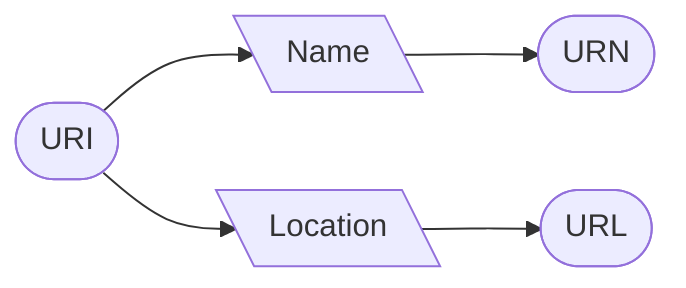

# URI Conventions

| <!-- -->                 | <!-- -->   |
| :-------------------     | :--------- |
| __Code__                 |            |
| __Version__              | 2.0-web    |
| __Status__               | Concept    |
| __Publication date__     | 2025-02-15 |
{: .header-table }

This document is a publication of MFF BAS. In the pursuit of completeness and correctness of data, we kindly request you to submit comments, additions and improvements regarding this document by [raising a ticket]({{ site.github.issues_url }}) in this repository. 

### Document annotations

Please find the following information here:

[Changes](changes.md) - for all changes in this publication\
[Signoffs](signoffs.md) - for notification and signoffs for publication\
[References](../references.md) - for references to other publications\
[Dictionary](../dictionary.md) - explanatory guide for terms and abbreviations

### Table of contents

* Do not remove this line (it will not be displayed)
{:toc}

## Introduction

This publication completes the [MFFBAS API design rules](../api-design-rules) with a strategy on URIs and is the result 
of the effort of the API Strategy Working Group. In order to make REST APIs retrievable, it is necessary to give them a 
digital address. Within the context of the Internet, these addresses are called URIs, with the most common form being a 
URL, also known as a link. The URI guidelines were chosen to be inspired by the URI strategy of the DSO as this strategy 
is mature and well thought-out. In addition, the sector itself also provides information services to the government. 
Various parties in the sector must themselves connect to the web services of the Dutch government. The present URI strategy 
is thus based on the following sources[^1]:
+ API strategy for the Dutch government;
+ API strategy of the DSO;
+ URI strategy of the DSO;
+ Insights from Alliander, Enexis, Stedin and EDSN.

URIs can be used for several things. The government distinguishes the following four different categories:
1. Web pages of user applications;
2. SOAP web services;
3. REST APIs;
4. Linked Data.

Since this URI strategy focuses on API use, we limit ourselves (for now) to REST API URIs. However, the application of the
convention discussed here already takes into account the use for other methods (see [Method of unlocking (technique)](#exposure-method-technique)).

Why is there a need for URI guidelines? URIs are inextricably linked to APIs. Every piece of information and/or functionality 
that is offered via an API needs an identification (URI), which makes a REST API discoverable and accessible. URI guidelines 
provide a practical translation for identifying APIs by developing a structure.

This document only describes the URI strategy and does not discuss its substantive application. For information on APIs, we refer to the MFFBAS API design guidelines. The use of this naming convention 
is limited but leading to use within the CMF. In practice, this applies to all REST APIs that EDSN and other sector organisations build and maintain. Other market roles are advised to follow these guidelines as much as possible.

[^1]: Referred documents can be found in the global [document reference](../references.html).

## Coherence of the concepts URI, URN, URL and resource

To understand this topic properly, a bit of explanation is needed about the definition of URIs, URNs and URLs. URIs provide 
a mechanism to refer to resources regardless of where they are located on the Internet. URIs are human-readable because 
this simplifies interpretation and establishing relationships. A "resource" can be anything, such as physical objects 
(transformer, cable, geographic location), abstractions (concept, model) as well as information elements (web page). The 
abbreviations URNs, URIs and URLs all contain the term "Resource". The resource is the basic concept on which the entire
naming convention is based.

A Uniform Resource Identifier (URI) is a standardized way to identify sources of information(web pages, text, images, etc.) 
on the Internet. A URI identifies a resource by a hierarchical description (string of characters) that usually represents a 
location on a network. URIs are unique references to digital objects. Identification by a URI enables interaction with 
different sources of information over a network (such as the World Wide Web). The most common form of a URI is the Uniform 
Resource Locator (URL), often referred to as a web address. URL and URN are both specific forms of a URI. A Uniform 
Resource Name (URN) uniquely describes the name of a "resource". A URN is a URI, but not a URL. This means that a URN 
without being embedded in a URI or URL cannot be found on the Internet. A Uniform Resource Locator (URL) uniquely describes 
the location of a "resource", and this location can be found on the Internet. A URL is used to give others access to a
resource. Within the DSO, URLs are used for SOAP services, REST APIs and Linked Data resources that are offered sector-wide.

Examples of URIs are:
+ ftp://ftp.is.co.za/rfc/rfc1808.txt
+ http://www.ietf.org/rfc/rfc2396.txt
+ ldap://[2001:db8::7]/c=GB?objectClass?one
+ mailto:John.Doe@example.com
+ telnet://192.0.2.16:80/
+ urn:oasis:names:specification:docbook:dtd:xml:4.1.2

## General principles
REST APIs are popular because of their simplicity and reuse of the HTTP protocol. This protocol uses a subset of the generic URIs discussed above, namely URLs.

The following principles apply to all URIs:

<!-- Included as separate rules -->

